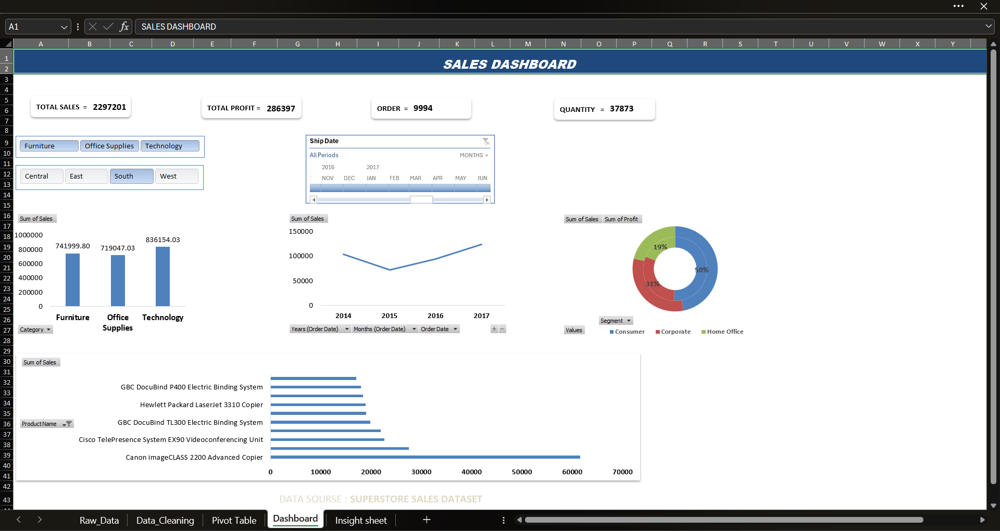
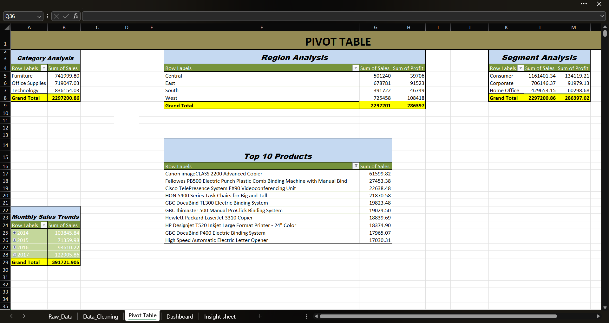
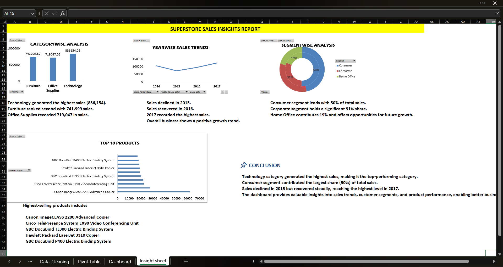

# 📊 Superstore Sales Analysis Dashboard (Microsoft Excel)

An interactive sales dashboard built using the **Superstore Sales Dataset** in Microsoft Excel. This project demonstrates the complete data analysis workflow, including data cleaning, Pivot Tables, interactive dashboard creation, and business insights generation to support data-driven decision-making.

---

## 📌 Project Overview

This project focuses on analyzing Superstore sales data to identify trends, customer behavior, product performance, and regional sales distribution. The raw dataset was cleaned and transformed before creating Pivot Tables and an interactive dashboard using Microsoft Excel.

The dashboard allows users to explore sales performance through interactive charts, slicers, and timeline filters, making it easier to understand key business metrics and insights.

---

## 🎯 Project Objectives

- Clean and prepare raw sales data.
- Analyze sales and profit performance.
- Summarize data using Pivot Tables.
- Build an interactive dashboard.
- Generate meaningful business insights for decision-making.

---

## 🛠️ Tools & Features Used

- Microsoft Excel
- Data Cleaning
- Pivot Tables
- Pivot Charts
- Slicers
- Timeline Filter
- Conditional Formatting
- Business Insights

---

## 📂 Project Structure

```text
Superstore-Sales-Analysis-Excel/
│
├── Raw_Data.xlsx
├── Data_Cleaning.xlsx
├── Pivot_Tables.xlsx
├── Dashboard.xlsx
├── Images/
│   ├── Dashboard.png
│   ├── Pivot_Tables.png
│   └── Insights.png
└── README.md
```

---

# 📸 Project Screenshots

## 📊 Dashboard



---

## 📈 Pivot Tables



---

## 💡 Business Insights



---

## 📊 Dashboard Highlights

- Sales Performance Analysis
- Profit Analysis
- Category-wise Sales
- Segment-wise Sales
- Region-wise Sales
- Year-wise Sales Trend
- Top 10 Products Analysis
- Interactive Slicers
- Timeline Filter

---

## 💡 Key Business Insights

- Technology generated the highest sales, reaching **836,154**, making it the top-performing category.
- Furniture ranked second with **741,999** in sales, followed by Office Supplies with **719,047**.
- Sales declined in **2015**, recovered in **2016**, and reached their highest level in **2017**, indicating a positive business growth trend.
- The Consumer segment contributed **50%** of total sales, making it the largest customer segment.
- The Corporate segment accounted for **31%** of total sales, while the Home Office segment contributed **19%**, highlighting opportunities for future growth.
- Canon image CLASS 2200 Advanced Copier was the highest-selling product among the Top 10 products.

---

## 📌 Conclusion

The Superstore Sales Analysis Dashboard provides a comprehensive view of sales performance across categories, customer segments, products, and yearly trends. The analysis reveals that the Technology category and Consumer segment are the primary drivers of sales, while sales recovered after 2015 and reached their highest level in 2017. This dashboard enables users to make data-driven decisions through interactive visualizations and meaningful business insights.

---

## 🚀 Skills Demonstrated

- Data Cleaning
- Data Analysis
- Data Visualization
- Dashboard Development
- Pivot Tables
- Pivot Charts
- Business Insight Generation
- Microsoft Excel

---

## 📊 Dataset

**Dataset:** Superstore Sales Dataset

---

## 👩‍💻 Author

**Shweta Yadav**

B.Tech Computer Science Engineering Student
---

## ⭐ Support

If you found this project useful, please consider giving it a ⭐ on GitHub.